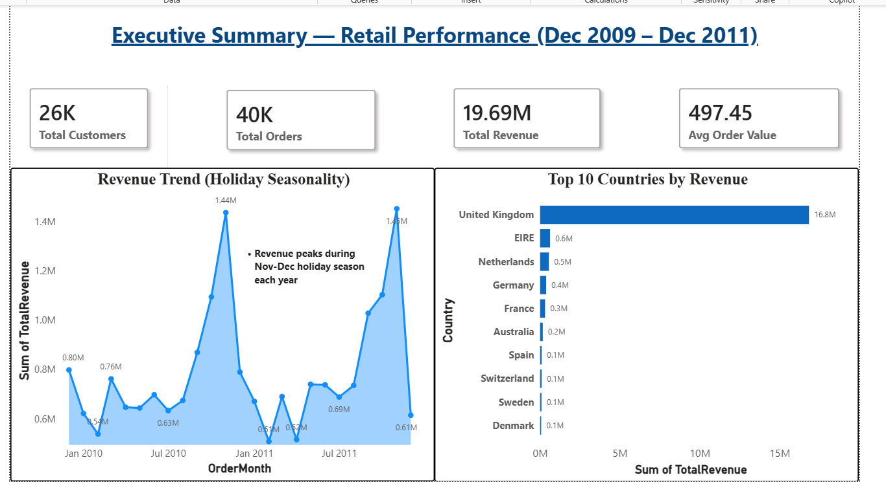
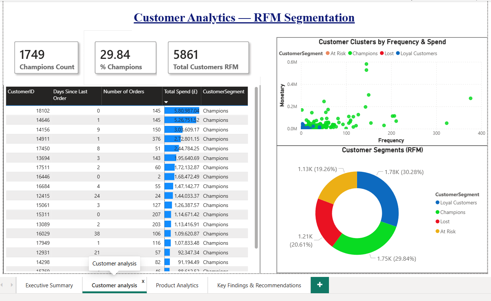
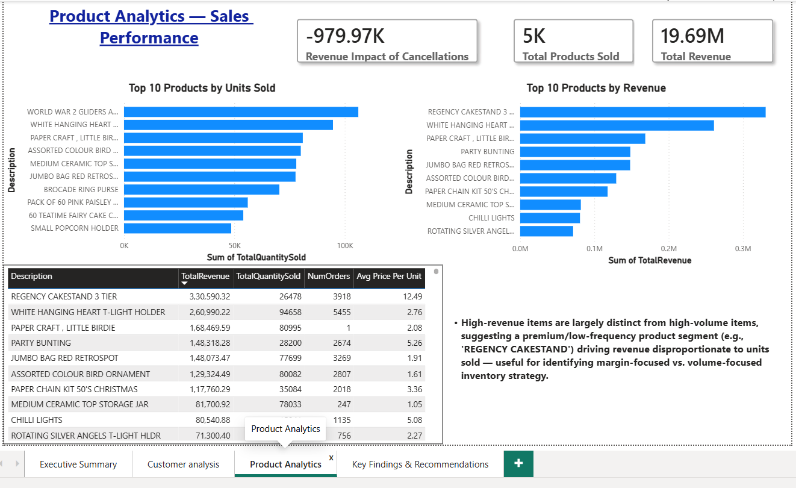
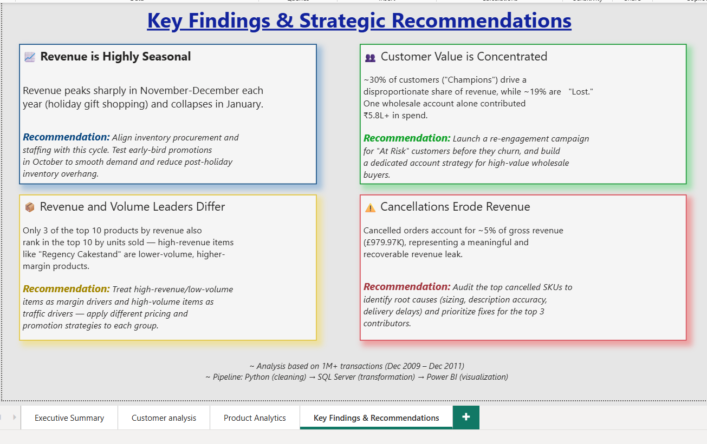

# 📊 Retail Sales Performance & Customer Insights Dashboard

This is an end-to-end data analytics project I built to practice the full pipeline a data analyst actually works with — cleaning messy real-world data in **Python**, transforming it and building business logic in **SQL Server**, and presenting insights through an interactive **Power BI** dashboard.

## 🎯 Problem Statement
I used a real UK-based online retailer's transaction dataset (2009-2011) and tried to answer questions a business would actually care about: Who are our best customers? What's driving our revenue? Where are we losing money? I wanted this project to go beyond just making charts — the goal was to actually find insights and turn them into recommendations.

## 🛠️ Tech Stack
- **Python** (Pandas, NumPy, SQLAlchemy) — for cleaning and preprocessing the raw data
- **SQL Server (SSMS)** — for transforming the data and writing business logic (RFM segmentation, aggregations)
- **Power BI** — for building the dashboard and DAX measures

## 📁 Dataset
[Online Retail II — UCI Machine Learning Repository](https://archive.ics.uci.edu/dataset/502/online+retail+ii)
Contains 1,067,371 raw transaction records from a UK-based online gift-ware retailer (Dec 2009 – Dec 2011).

## 🧹 Data Cleaning (Python)
The raw data had a lot of real-world messiness I had to work through:
- Removed 34,335 duplicate rows and 6,207 rows with invalid (zero/negative) prices
- Found 19,494 cancelled orders — but also noticed 3,456 more rows with negative quantities that *weren't* formally cancelled, so I flagged those separately as returns instead of treating them all the same
- Instead of just dropping rows with missing Customer IDs, I flagged them as guest orders so I wouldn't lose real revenue data
- Removed non-product codes like postage and bank charges that weren't actual sales
- Created new columns: Revenue, OrderMonth, DayOfWeek
- **Result:** went from 1,067,371 rows down to 1,021,732 clean rows (~4.3% removed), then pushed this to SQL Server using SQLAlchemy

## 🗄️ SQL Transformation
I built 5 views in SQL Server to handle the business logic, so Power BI could just connect to clean, pre-aggregated data instead of raw tables:
- `vw_MonthlyRevenue` — monthly revenue, order counts, and average order value
- `vw_RFM` — this was the one I spent the most time on. Segments customers using Recency, Frequency, and Monetary value (via `NTILE()`) into Champions / Loyal Customers / At Risk / Lost
- `vw_TopProducts` — revenue and quantity sold per product
- `vw_CountryPerformance` — revenue breakdown by country
- `vw_CancelledImpact` — calculates how much revenue is lost to cancelled orders

## 📊 Power BI Dashboard (4 Pages)
**1. Executive Summary** — KPIs, revenue trend over time, top countries by revenue
**2. Customer Analytics** — RFM segmentation, a scatter plot clustering customers by frequency/spend, and a top customers table
**3. Product Analytics** — top products by revenue vs. by units sold (they're often not the same products), plus cancellation impact
**4. Key Findings & Recommendations** — I added this page specifically to summarize what the data actually means for the business, not just show more charts

## 💡 Key Insights I Found
- **Seasonality**: Revenue spikes sharply every November-December (holiday season) and drops off hard in January — this could inform inventory and staffing decisions
- **Customer concentration**: About 30% of customers ("Champions") are driving most of the revenue, while ~19% are "Lost." One wholesale customer alone spent over £77,000
- **Revenue vs. volume aren't the same thing**: Only 3 of the top 10 products by revenue also show up in the top 10 by units sold — meaning some products make a lot of money despite lower sales volume (premium items), while others sell a ton but at low margins
- **Cancellations add up**: about 5% of gross revenue (~£980K) is lost to cancelled orders — worth investigating further

## 📈 Key Metrics
| Metric | Value |
|---|---|
| Total Customers | 26K |
| Total Orders | 40K |
| Total Revenue | £19.69M |
| Avg Order Value | £497.45 |
| Transactions Processed | 1M+ |

## 📸 Dashboard Preview

## 🚀 How to Run
1. Run `data_cleaning.ipynb` on the raw dataset to get the cleaned CSV
2. Run `sql_views.sql` in SQL Server Management Studio on the imported cleaned table
3. Open `Retail_Analytics_Dashboard.pbix` in Power BI Desktop, connect it to your SQL Server instance, and hit refresh

## 📝 What I Learned
This project taught me that cleaning data isn't just about dropping bad rows — it's about making judgment calls (like guest orders vs. dropped data, or returns vs. cancellations) that actually affect the accuracy of downstream analysis. I also learned that a dashboard is only useful if it answers a business question, not just displays numbers — which is why I added the Key Findings page after realizing my first draft was just charts without a "so what."
